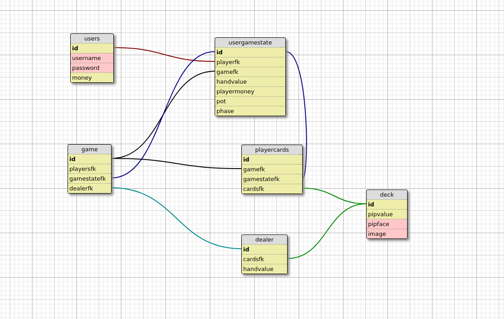

# Blackjack
<<<<<<< HEAD
## updating the readme for testing

=======
BlackJack Database

## users table
Stores the information about the current users account username and password and the money the user has to bet on in game.

username - The username of the current user account.

password - The password associated with the users account.

money - The currency available in user account that used for betting. This will be updated when the user places a bet or wins. By default the user starts at $2000.

## game table
Keeps track of the current games being played with players and dealer associated to the game.

playerfk - Reference to player(s) in the current game.

dealerfk - Reference to the dealer in the current game.

## usergamestate table
Keeps track of the current state of the game which includes the players, current money, hand value, phase of game, and amount the player bets.

playerfk - Reference to player(s) in the current game.

gamefk - Reference to game that the current state corresponds to.

handvalue - Summation of the pip values of the player(s) hand.

playermoney - The currency available in user account that used for betting. This will be updated when the user places a bet or wins. When the player exits the game this value will be used to update the money column in the corresponding users table.

pot - The amount of money the user bets each round. This is the amount of money the user gets if they win is doubled the initial bet. If they lose this amount gets removed from the player's money column.

phase - Current stage of the game the user is in.

## playercards table
The players cards in the current game.

gamefk- Reference to game that the current state corresponds to.

gamestatefk- Reference to the current game state of the player cards that it corresponds to.

cardfk- Reference to the card deck. This is how we know what the actual card is in their hand. It will give us access to values of the card like, the pip value, and the image accociated with the card.

## deck table
The 52 cards in a regular deck of playing cards.

pipvalue - The integer value of the card.

pipface - The string value that describes the card.

image - Used for the front end to represent the card.

## dealer table
The cards in the current game accociated with the current dealer.

cardfk - Reference to the card deck. This is how we know what the actual card is in their hand. It will give us access to values of the card like, the pip value, and the image accociated with the card.

handvalue- Summation of the pip values of the dealer's hand.
>>>>>>> c66d9d0977c0bb1df6c2d48256790c8eee646bc5
